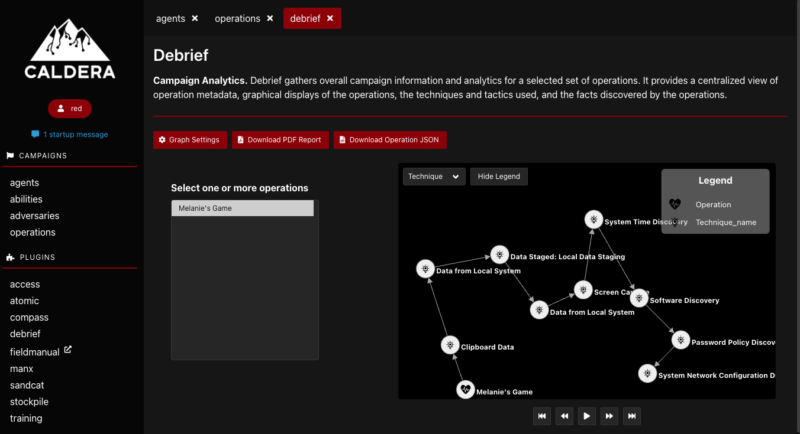
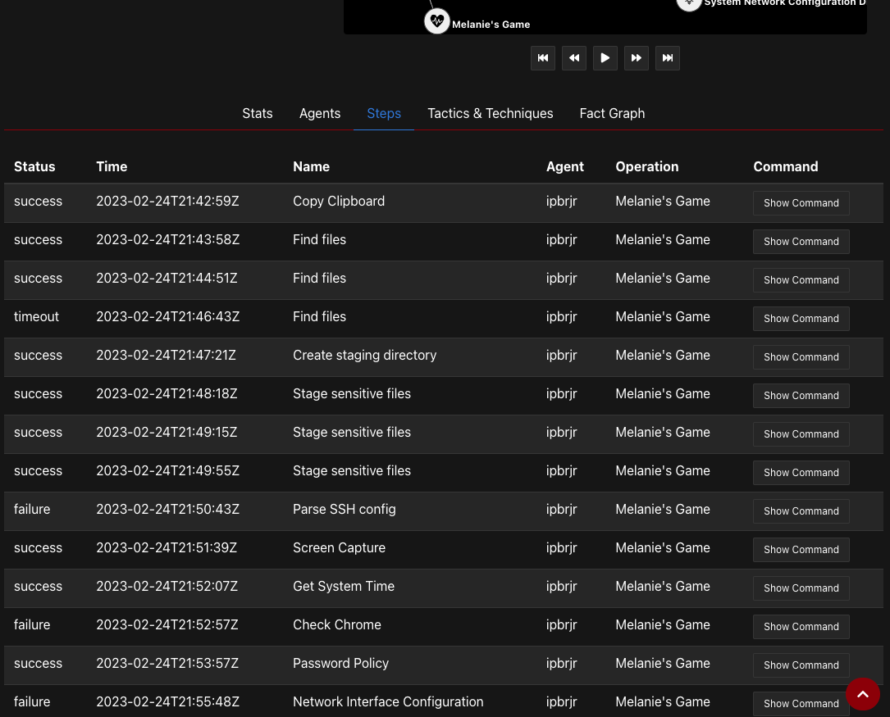
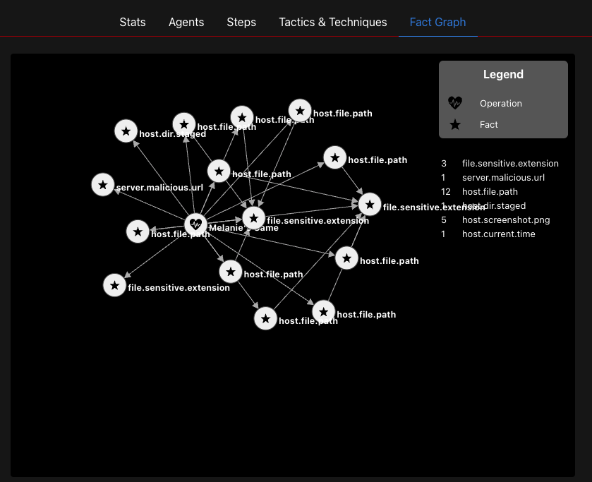

# CALDERA Debrief

A CALDERA plugin: https://github.com/mitre/caldera

Debrief is a plugin for gathering overall campaign information and analytics for a selected set of 
operations. It provides a centralized view of operation metadata, graphical displays of the operations, 
the techniques and tactics used, and the facts discovered by the operations. The plugin additionally 
supports the export of campaign information and analytics in PDF format.

Example generated PDF: [debrief_2020-09-14_16-03-43.pdf](docs/debrief_2020-09-14_16-03-43.pdf)

