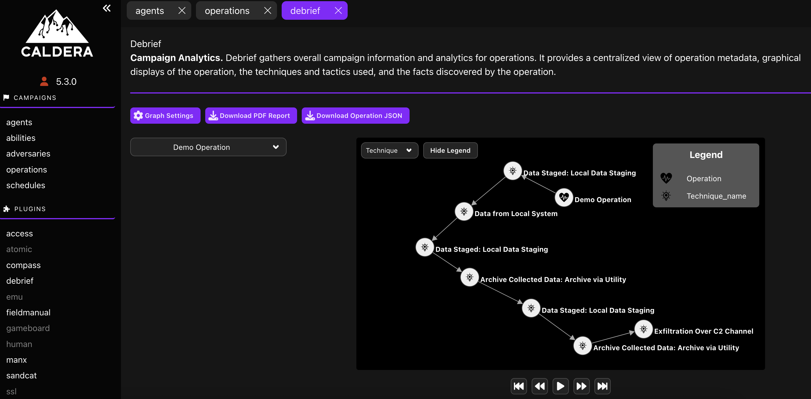
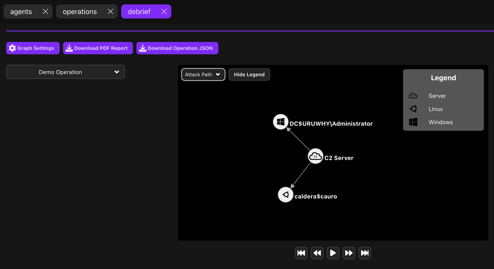
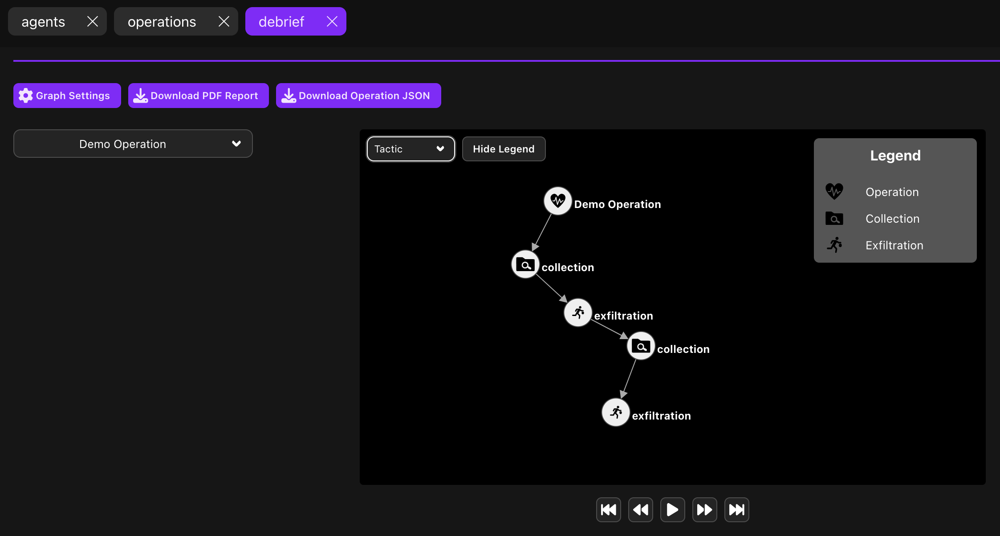
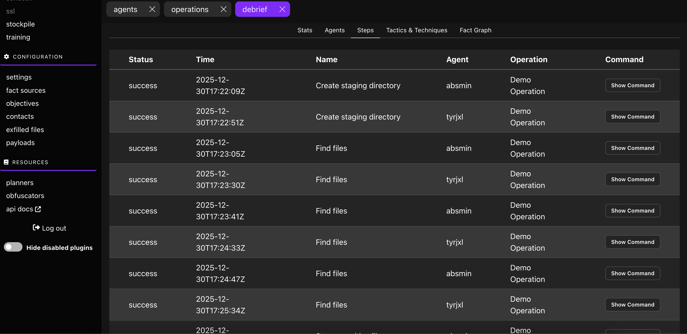
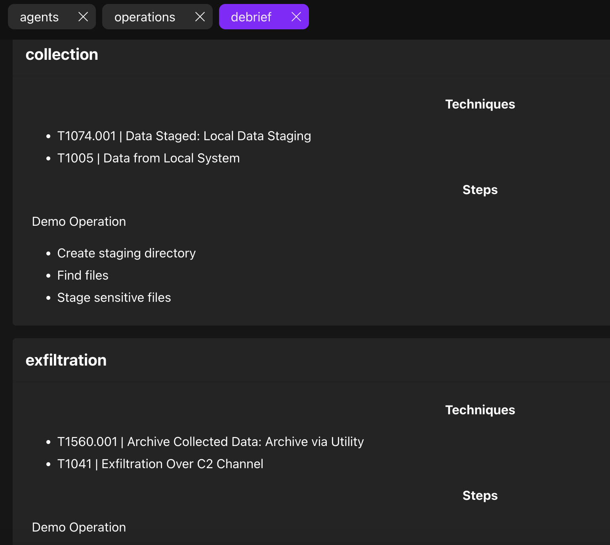
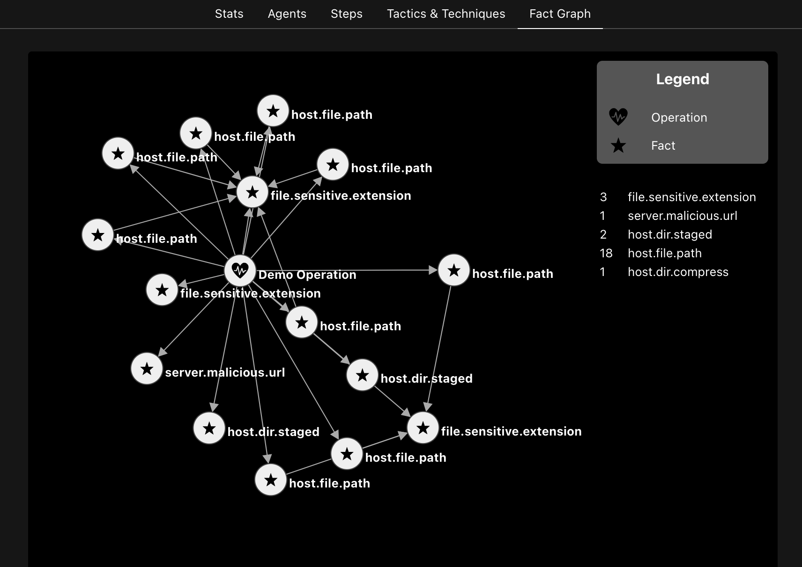

# MITRE Caldera Plugin: Debrief

A Caldera plugin: https://github.com/mitre/caldera

Debrief is a plugin for gathering overall campaign information and analytics for 
operations. It provides a centralized view of operation metadata, graphical displays of the operation, 
the techniques and tactics used, and the facts discovered by the operation. The plugin additionally 
supports the export of campaign information and analytics in PDF format.

Example generated PDF for an operation with both successful and unsuccessful steps: [Caldera Debrief Report](docs/Demo-Operation_Debrief_Example.pdf)

