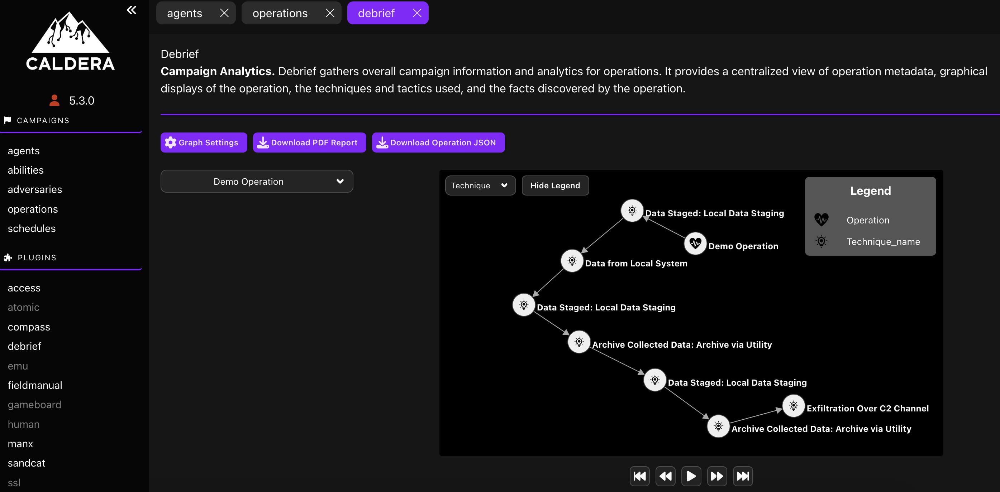
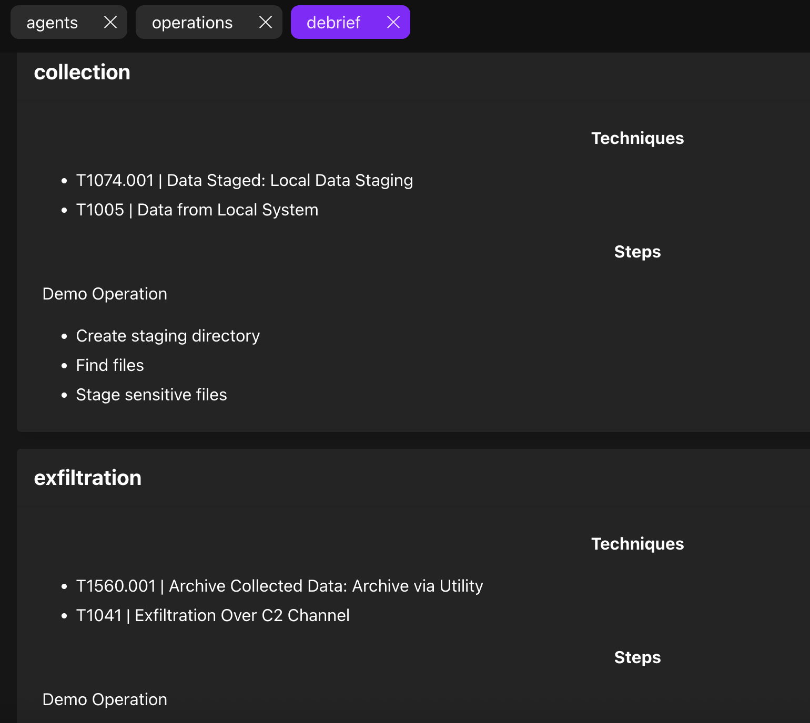

# MITRE Caldera Plugin: Debrief

A Caldera plugin: https://github.com/mitre/caldera

Debrief is a plugin for gathering overall campaign information and analytics for
operations. It provides a centralized view of operation metadata, network topology
visualization with replay, the techniques and tactics used, and the facts discovered
by the operation. The plugin additionally supports the export of campaign information
and analytics in PDF format.

## Network Topology Replay

Interactive network topology visualization with progressive replay of operation steps,
subnet grouping, pivot point indicators, and discovered host enumeration.

## Features

- **Network Topology Canvas** — Horizontal subnet columns with OS-specific host icons, pivot indicators, and discovered host visualization
- **Operation Replay** — Progressive reveal of hosts and network paths as the operation unfolds, with beacon callback animation
- **Slide-out Host Detail** — Click any host to see steps executed, facts collected, and gathered intel
- **PDF Report Generation** — Export campaign analytics including topology, statistics, agents, TTPs, and detection strategies
- **ATT&CK v18 Detection Mapping** — Maps operation techniques to MITRE ATT&CK v18 detection strategies and analytics
- **Dark Theme UI** — Styled tables and cards matching Caldera's purple theme

## Legacy Views

Example generated PDF: [Caldera Debrief Report](docs/Demo-Operation_Debrief_Example.pdf)
