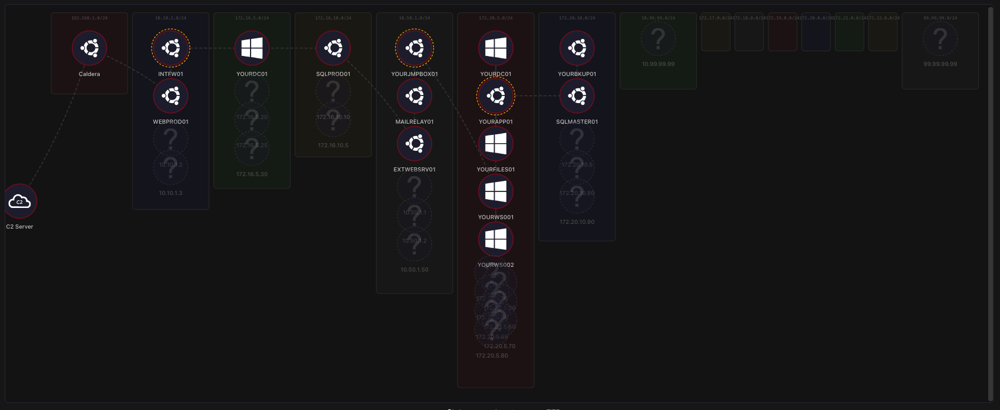
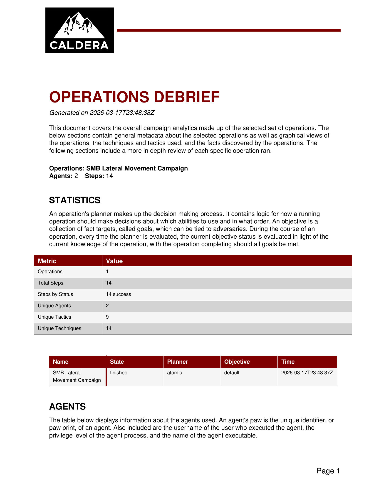

# MITRE Caldera Plugin: Debrief

A plugin for [MITRE Caldera](https://github.com/mitre/caldera)

Debrief is a plugin for gathering overall campaign information and analytics for
operations. It provides a centralized view of operation metadata, network topology
visualization with replay, the techniques and tactics used, and the facts discovered
by the operation. The plugin additionally supports the export of campaign information
and analytics in PDF format.

## Network Topology Replay

Interactive network topology visualization with progressive replay of operation steps,
subnet grouping, pivot point indicators, and discovered host enumeration.



## PDF Report Generation

Export campaign analytics as a comprehensive PDF including campaign metrics, agent details,
tactics & techniques with ATT&CK v18 detection strategy mapping, and step output.



[View full example PDF](docs/Demo-Operation_Debrief_Example.pdf)

## Features

- **Network Topology Canvas** — Horizontal subnet columns with OS-specific host icons, pivot indicators, and discovered host visualization
- **Operation Replay** — Progressive reveal of hosts and network paths as the operation unfolds, with beacon callback animation
- **Slide-out Host Detail** — Click any host to see steps executed, facts collected, and gathered intel
- **PDF Report Generation** — Export campaign analytics including topology, statistics, agents, TTPs, and detection strategies
- **ATT&CK v18 Detection Mapping** — Maps operation techniques to MITRE ATT&CK v18 detection strategies and analytics
- **Dark Theme UI** — Styled tables and cards matching Caldera's purple theme

## Installation

### As a Caldera Submodule (Recommended)

Clone Caldera with the debrief plugin included:

```bash
git clone https://github.com/mitre/caldera.git --recursive
```

If Caldera is already cloned, add debrief as a plugin:

```bash
cd caldera/plugins
git clone https://github.com/mitre/debrief.git
```

### Enable the Plugin

Add `debrief` to the list of enabled plugins in your Caldera configuration file (`conf/local.yml` or `conf/default.yml`):

```yaml
plugins:
  - debrief
```

### Install Python Dependencies

From your Caldera virtual environment:

```bash
pip install -r plugins/debrief/requirements.txt
```

### Build the Vue UI

Debrief uses the Magma Vue.js framework. Rebuild Magma to include the debrief plugin UI:

```bash
cd caldera/plugins/magma
npm install
npm run build
```

Or start Caldera with the `--build` flag:

```bash
python server.py --insecure --build
```

> **Note:** Requires Node.js >= 20.19 or >= 22.12 for Vite 7.

### Start Caldera

```bash
cd caldera
python server.py --insecure
```

Navigate to the Caldera UI and click on the **debrief** plugin in the sidebar.

## Running Tests

```bash
cd caldera/plugins/debrief
pip install pytest pytest-asyncio
python -m pytest tests/ -v
```

## Configuration

Plugin configuration options can be set in `plugins/debrief/conf/default.yml`:

- `reportlab_trusted_hosts` — List of trusted hosts for ReportLab SVG rendering (optional)
