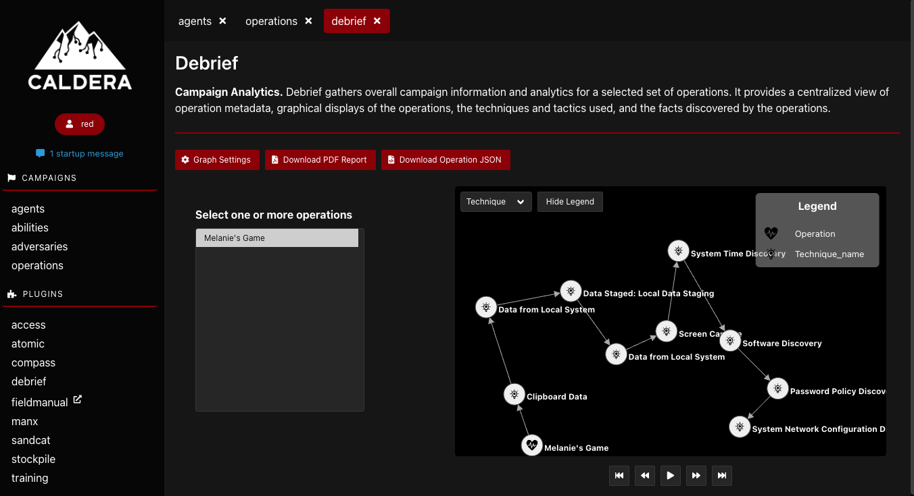
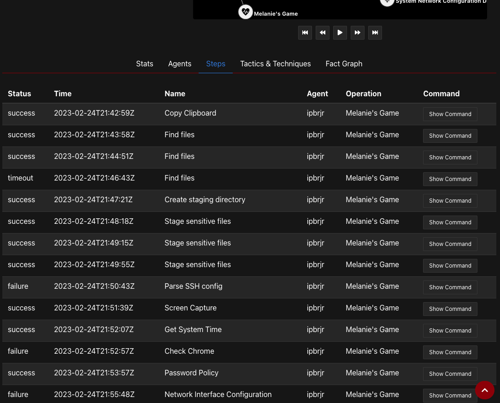
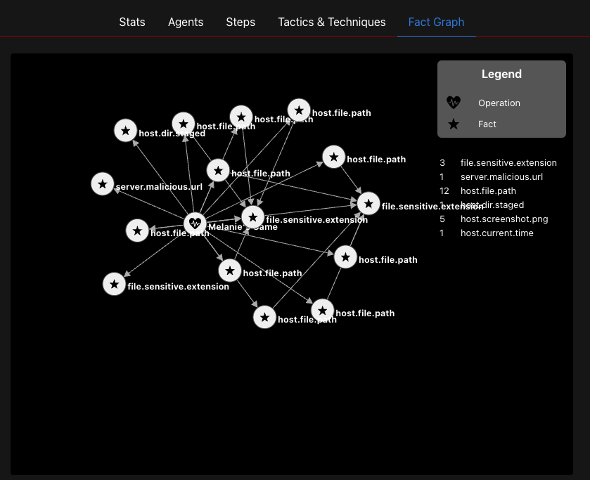

# MITRE Caldera Plugin: Debrief

## Overview:

The Debrief plugin provides post-operation insights and reporting. This plugin does so by gathering overall campaign information and analytics for a selected set of operations. It then provides a centralized view of operation metadata, graphical displays of the operations, the techniques and tactics used, and the facts discovered by the operations. The plugin additionally supports the export of campaign information and analytics in PDF format.

### Context:
Reporting / post-execution analysis

<!-- ### Known Limitations: -->

## Installation:

This is a core CALDERA plugin and is loaded by default via the plugin loader. Ensure it is present in the `plugins/` directory and listed as enabled in your active configuration file (e.g., `conf/default.yml`).

## Dependencies/Requirements:

No additional dependencies are required beyond a standard CALDERA installation.

## Getting Started:

Here is an example of the generated PDF: [Caldera Debrief Report](docs/debrief_2023-02-24_17-08-14.pdf)

